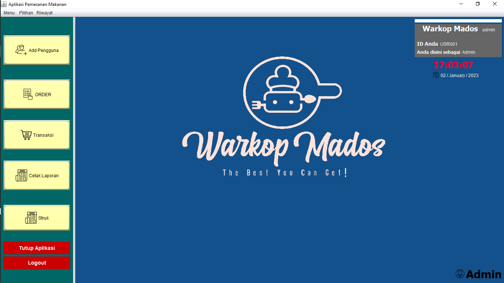
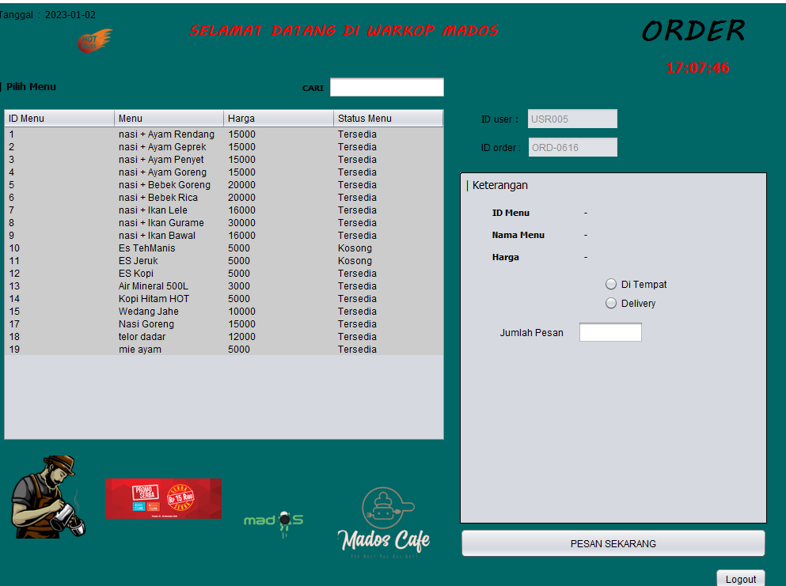

PROJECT AKHIR SEMESTER 5

PEMROGRAMAN BERORIENTASI OBJECT

* website official free :
* https://officialmados.000webhostapp.com/

* KELOMPOK

| NAMA        |   NIM      |
|-------------------|-------------------|
| M.RIZKY ABDILLAH        | 312010386   |
| RAMON MISTER HADI      | 312010508    |
| FARIS ARYANO PIRSADA     | 312010371 |
| HELMI SALAS FAZRI      | 312010412    |

## APLIKASI PEMBELANJAAN ONLINE (WARKOP MADOS)

# TOOLS yang di gunakan

1. Netbeans 8.2
2. XAMPP 3.2
3. ADOBE XD

# TECH Stack yang di gunakan

1. Java Swing
2. MySQL V.15
3. JDK 8

# VITUR Yang di gunakan

1. Multi User (admin & user)
2. Preview,Struk,Pembelian
3. Data Menu Makanan (Cari, Ubah, Tambah, Hapus)
4. History Transaksi (Cari id Transaksi, Filter Nama Makanan, Filter Tanggal dan Melihat Jumlah Transaksi)

# Vitur Tampilan

1. admin

2. pelanggan

# Manfaat Dan Tujuan Aplikasi

* Aplikasi pemesanan makanan dan minuman oada rumah makan merupakan suatu sistem yang memberukan kemudahan dalam melakukan transaksi pemesanan sehingga dapat mempermudah segala proses transaksi dalam pemesanan sehingga meminimalisir kesalahan dalam pencatatan data. 

* Tujuan dalam pembuatan aplikasi pemesanan makanan dan minuman ini adalah dapat mempermudah pekerjaan dalam pencatatan agar pemesanan lebih mudah

